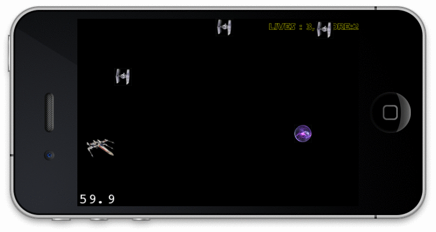



# Cocos2d

Cocos2d es una librería basada en OpenGL ES para crear juegos para iPhone, iPod touch y iPad. En realidad es un port de la librería con el mismo nombre escrita en python. Es una de las librerías más famosas y extendidas por su sencillez. Hay mucha documentación y material en internet.

# Objetivo

## Instalación

Los pasos de instalación son descargar el código fuente e instalar unas plantillas de proyectos.

    git clone git://github.com/cocos2d/cocos2d-iphone.git
    cd cocos2d-iphone/
    ./install-templates.sh -u
    

Esto además de las librerías instalará unas plantillas para la creación de proyectos.

## Creación del proyecto

Para crear el proyecto nuevo vamos a utilizar una de las plantillas instaladas.

`File/New/Project/cocos2D`

Product Name : `starwars`

Esto creará la estructura básica del proyecto y nos creará 3 clases importantes: 

* AppDelegate: Delegate de la aplicación se encarga de la inicialización
* RootViewController : Controlador para gestionar la rotación del juego (no es necesario modificarlo)
* HelloWorldLayer: Layer de la aplicación

Una aplicación Cocos2d se divide en varias escenas. Las escenas son como pantallas o niveles de un juego. Por ejemplo, podremos tener una escena para cada uno de los niveles del juego, una escena con el menú, otra con el gameover... Dentro de las escenas se tienen distintos layers. Podemos pensar en un layer como una capa de photoshop. Los layer pueden tener distintos nodos: sprites, labels, menus, ...

El template del proyecto crea la clase `HelloWorldLayer` que tiene una método `+(CCScene *) scene` que se encarga de preparar la scene principal. Esta escena tiene una única capa (`HelloWorldLayer`).

	-(id) init {
		if((self=[super init])) {
			CCLabelTTF *label = [CCLabelTTF labelWithString:@"Hello World" fontName:@"Marker Felt" fontSize:64];
			CGSize size = [[CCDirector sharedDirector] winSize];
			label.position =  ccp(size.width /2 , size.height/2);
			[self addChild: label];
		}
		return self;
	}

El método init es el que prepara el layer. Crea una etiqueta y la alinea en el centro de la pantalla. Por último añade la etiqueta al layer.

El helper `ccp` sirve para crear un `CGPoint` a partir de unas coordenadas x e y.

En el sistema de coordenadas que utiliza cocos2d el origen (0,0) está en la esquina inferior izquierda y aumenta hacia arriba y hacia la derecha. La esquina superior derecha son las coordenadas (480, 320). Por defecto la posición de un objeto es relativa al centro del mismo. Esto se puede modificar con la propiedad `anchorPoint` ya lo veremos más adelante.

# Crea un nuevo layer

Crea un nuevo layer `GameLayer`. Puedes renombrar `HelloWorldLayer` o puedes crear uno nuevo. Si creas un nuevo layer asegúrate de que en la clase `AppDelegate` inicias el nuevo layer.

	[[CCDirector sharedDirector] runWithScene: [GameLayer scene]];

# Sprites

Los Sprites están representados por la clase `CCSprite`. Para iniciar un sprite y añadirlo al layer

	-(id) init {
	    self = [super init];
		if(self){
			CCSprite *xwing = [CCSprite spriteWithFile:@"xwing.png" rect:CGRectMake(0, 0, 50, 50)];
			CGSize size = [[CCDirector sharedDirector] winSize];
			xwing.position =  ccp(size.width/2 , size.height/2);
			[self addChild: xwing];
		}
		return self;
	}

Este código crea un sprite de dimensiones 50x50 a partir de una imagen y lo alinea en el centro de la pantalla.

Para el juego nos va a hacer falta naves espaciales, letras y música. Añado un zip con los recursos que utilicé. Si prefieres utilizar otros no hay problema.

[Recursos para juego](resources/game.zip)

Contenido:
* Starjhol.ttf    - Tipo de letra
* imperial.mp3    - Música de la marcha imperial
* plasma.png      - Imagen de bola de plasma (30 x 30)
* tieFighter.png  - Nave enemiga (30 x 30)
* xwing.png       - Nave buena (50 x 33)

Descarga el paquete y añade todos estos recursos a la carpeta Resources del proyecto.

## Animaciones

Para realizar animaciones tenemos dos opciones.

La primera es utilizar un método que se repite periódicamente y actualiza la posición del sprote. El código para el primer caso sería

	- (void)update:(ccTime)dt  {
		//update the position
		xwing.position = ccp(xwing.position.x, xwing.position.y + 200 * dt);
	}
    
	- (id)init {
	    self = [super init];
		if(self){
	        [self schedule:@selector(update:)];
		}
		return self;
	}

El parámetro `dt` es el diferencial de tiempo desde la última invocación al método. Tal como definimos el método estamos haciendo que la nave se mueva 200 pixeles por segundo en el eje de las y.

La segunda opción es utilizar acciones. Con acciones podemos especificar la posición de destino y el tiempo que debe tardar en alcanzarla. El código en este caso sería:

    id actionMove = [CCMoveTo actionWithDuration:animationDuration 
                                        position:destinationPosition];
    id actionMoveDone = [CCCallFuncN actionWithTarget:self 
                                             selector:@selector(spriteMoveFinished:)];
    [sprite runAction:[CCSequence actions:actionMove, actionMoveDone, nil]];

# Touch

En este caso, los gestos que vamos a utilizar son muy sencillos. Únicamente vamos a tener en cuenta si el usuario esta tocando la pantalla o no.

Para ello tenemos que importar la clase `CCTouchDispatcher`

	#import "CCTouchDispatcher.h"

Debemos indicar que el layer debe responder a gestos

	self.isTouchEnabled = YES;

Y estos son los métodos que se ejecutan cuando el gesto empieza y cuando el gesto termina respectivamente. El return YES del primer método indica que vamos a estar pendiente de cuando ese evento se termina. Si devolvieramos NO, nunca se llamaría el método TouchEnd.

	-(BOOL) ccTouchBegan:(UITouch *)touch withEvent:(UIEvent *)event {
	 	
	    return YES;
	}
    
	-(void) ccTouchEnded:(UITouch *)touch withEvent:(UIEvent *)event { 
	    inTouch = false;
	}
    
	-(void) registerWithTouchDispatcher {
		[[CCTouchDispatcher sharedDispatcher] addTargetedDelegate:self priority:0 swallowsTouches:YES];
	}	

## Todo junto

Con lo que hemos visto hasta ahora ya somos capaces de tener una primera versión del juego. En esta primera versión del juego añadiremos la nave buena y las naves enemigas. Añadiremos el movimiento de las naves enemigas y y la intereccación.

### Añade el sprite del XWing

	@interface GameLayer : CCLayer {
	    CCSprite *xwing;
	}
    
	-(void) addXWing {
	    xwing = [CCSprite spriteWithFile:@"xwing.png" rect:CGRectMake(0, 0, 50, 33)];
	    
	    CGSize winSize = [[CCDirector sharedDirector] winSize];
	    xwing.position = ccp(0 + kXWingMarginLeft, winSize.height /2);
	    
	    [self addChild:xwing];
	}
    
	-(id) init {
	    self = [super init];    
		if(self) {
	        [self addXWing];
		}
		return self;
	}

### Añade la interacción con el XWing

	@interface GameLayer : CCLayer {
	    CCSprite *xwing;
	    
	    BOOL isTouching;
	}
    
	#import "CCTouchDispatcher.h"
	#define kXWingUpSpeed 200
	#define kXWingDownSpeed 100
    
    
	- (void)moveXWingY:(long)yDistance {
	    xwing.position = ccp(xwing.position.x, xwing.position.y + yDistance);
	}
    
	- (void)limitXWingPositionInScreen {
	    CGSize winSize = [[CCDirector sharedDirector] winSize];    
	    
	    CGFloat midHeight = xwing.contentSize.width / 2;
	    CGFloat top = xwing.position.y + midHeight;
	    CGFloat bottom = xwing.position.y - midHeight; 
	    
	    if(top >= winSize.height){
	        xwing.position = ccp(xwing.position.x, winSize.height - midHeight);
	    }else if(bottom < 0){
	        xwing.position = ccp(xwing.position.x, 0 + midHeight);
	    }
	}
    
	- (void)nextFrame:(ccTime)dt {
	    if(isTouching){
	        [self moveXWingY:kXWingUpSpeed * dt];
	    }else{
	        [self moveXWingY:-kXWingDownSpeed * dt];
	    }
	    [self limitXWingPositionInScreen];
	}
    
	#pragma mark - init
    
	- (id)init {
	    self = [super init];    
		if(self) {
	        isTouching = NO;
	        self.isTouchEnabled = YES;
	        
	        [self addXWing];
	        
	        [self schedule:@selector(nextFrame:)];
		}
		return self;
	}
    
	#pragma mark - touches
    
	- (BOOL)ccTouchBegan:(UITouch *)touch withEvent:(UIEvent *)event {
	    isTouching = YES;
	    return YES;
	}
    
	- (void)ccTouchEnded:(UITouch *)touch withEvent:(UIEvent *)event { 
	    isTouching = NO;
	}
    
	- (void)registerWithTouchDispatcher {
		[[CCTouchDispatcher sharedDispatcher] addTargetedDelegate:self priority:0 swallowsTouches:YES];
	}

### Plasma

	@interface GameLayer : CCLayer {
	    CCSprite *xwing;
	    
	    BOOL isTouching;
	    
	    NSMutableArray *plasmas;
	}

	#define kPlasmaTag 1
	#define kPlasmaInteral 2
    
	#define kAnimationMinDuration 2.0
	#define kAnimationMaxDuration 4.0
    
	#define ARC4RANDOM_MAX      0x100000000

	#pragma mark - randoms
	+ (int)randomIntBetweenMin:(int)min andMax:(int)max {
	     return (arc4random() % (max-min + 1)) + min ;
	}
    
	+ (float)randomFloatBetweenMin:(float)min andMax:(float)max {
	    return floorf(((double)arc4random() / ARC4RANDOM_MAX) * (max - min)) + min;    
	}
    
	#pragma mark - plasma
    
	-(void)spriteMoveFinished:(id)sender {
	    CCSprite *sprite = (CCSprite *)sender;
    
	    if(sprite.tag == kPlasmaTag){
	        [plasmas removeObject:sprite];        
	    }
	    [self removeChild:sprite cleanup:YES];
	}
    
	- (void)randomMove:(CCSprite*)sprite {        
	    CGSize winSize = [[CCDirector sharedDirector] winSize];
	    
	    int minY = sprite.contentSize.height/2;
	    int maxY = winSize.height - sprite.contentSize.height/2;
	    int actualY = [GameLayer randomIntBetweenMin:minY andMax:maxY];
	        
	    sprite.position = ccp(winSize.width + (sprite.contentSize.width/2), actualY);
	    [self addChild: sprite];
	     
	    ccTime duration = [GameLayer randomFloatBetweenMin:kAnimationMinDuration andMax:kAnimationMaxDuration];
	    
	    id actionMove = [CCMoveTo actionWithDuration:duration 
	                                        position:ccp(-sprite.contentSize.width/2, actualY)];
	    id actionMoveDone = [CCCallFuncN actionWithTarget:self 
	                                             selector:@selector(spriteMoveFinished:)];
	    [sprite runAction:[CCSequence actions:actionMove, actionMoveDone, nil]];
	}
    
	- (void)addPlasma {
	    CCSprite *plasma = [CCSprite spriteWithFile:@"plasma.png" rect:CGRectMake(0, 0, 30, 30)];
	    plasma.tag = kPlasmaTag;
	    
	    [self randomMove:plasma];
	    [plasmas addObject:plasma];    
	}

### Detección de colisiones

	#pragma mark - collisions
    
	- (CGRect)rectFromSprite:(CCSprite *)sprite {
	    return CGRectMake(
	                      sprite.position.x - (sprite.contentSize.width/2), 
	                      sprite.position.y - (sprite.contentSize.height/2), 
	                      sprite.contentSize.width, 
	                      sprite.contentSize.height);
	}
    
	- (NSArray *)detectXWingCollisions:(NSArray*)sprites {
	    NSMutableArray *collisions= [[NSMutableArray alloc] init];
	    CGRect shipRect = [self rectFromSprite:xwing];
	    for(CCSprite *sprite in sprites){
	        CGRect spriteRect = [self rectFromSprite:sprite];
	        
	        if(CGRectIntersectsRect(shipRect, spriteRect)){
	            [collisions addObject:sprite];
	        }
	    }
	    return collisions;
	}
    
	- (BOOL)detectCollions {
	    BOOL collisions = NO;
	    NSArray *plasmasCollisions = [self detectXWingCollisions:plasmas];
	    
	    if(plasmasCollisions.count > 0){
	        collisions = YES;
	    }
	    
	    for(CCSprite *plasma in plasmasCollisions){
	        [self spriteMoveFinished:plasma];
	    }
	    
	    [plasmasCollisions release];    
	    return collisions;
	}

## Ejercicio

* Añade tieFighters. El movimiento que deben realizar es similar al de las bolas de plasma.
* Añade variables con la puntuación (incrementa cuando la nave coge una bola de plasma) y otra variable con las vidas (disminuye cuando se choca con otra nave)
* Añade etiquetas para mostrar el valor de la puntuación y de las vidas



## Solución

	@interface GameLayer : CCLayer {
	    CCSprite *xwing;
	    
	    BOOL isTouching;
	    
	    NSMutableArray *plasmas;
	    NSMutableArray *ties;
        
	    long lives;
    	long score;
    
    	CCLabelTTF *scoreBoardLabel;
	}

	#define kTieTag 2
	#define kTieInterval 1

	-(void)spriteMoveFinished:(id)sender {
	    CCSprite *sprite = (CCSprite *)sender;
	    
	    if(sprite.tag == kPlasmaTag){
	        [plasmas removeObject:sprite];        
	    }else if(sprite.tag == kTieTag){
	        [ties removeObject:sprite];        
	    }
	    [self removeChild:sprite cleanup:YES];
	}
    
	- (void)addTie {
	    CCSprite *tie = [CCSprite spriteWithFile:@"tieFighter.png" rect:CGRectMake(0, 0, 30, 30)];
	    tie.tag = kTieTag;
	    
	    [self randomMove:tie];
	    [ties addObject:tie];       
	}
    
	- (BOOL)detectCollions {
	    BOOL collisions = NO;
	    NSArray *plasmasCollisions = [self detectXWingCollisions:plasmas];
	    NSArray *tiesCollisions = [self detectXWingCollisions:ties];
	    
	    if(plasmasCollisions.count > 0){
	        collisions = YES;
	        score = score + 1;
	    }
	    
	    if(tiesCollisions.count > 0){
	        collisions = YES;
	        lives = lives - 1;
	    }
	    
	    for(CCSprite *plasma in plasmasCollisions){
	        [self spriteMoveFinished:plasma];
	    }
        
	    for(CCSprite *tie in tiesCollisions){
	        [self spriteMoveFinished:tie];
	    }
	    
	    [plasmasCollisions release];
	    [tiesCollisions release];
	    return collisions;
	}
    
	#pragma mark - scoreboard
    
	- (NSString *)scoreBoardString {
	    return [NSString stringWithFormat:@"lives : %ld, score:%ld", lives, score];
	}
    
	- (void)initScoreBoard {
	    lives = kInitialLives;
	    score = 0;    
	    
	    scoreBoardLabel = [CCLabelTTF labelWithString:[self scoreBoardString]
	                                         fontName:@"Starjhol.ttf" 
	                                         fontSize:15];
	    CGSize size = [[CCDirector sharedDirector] winSize];    
	    scoreBoardLabel.anchorPoint = ccp(1,1);
	    scoreBoardLabel.position =  ccp(size.width, size.height);
	    [scoreBoardLabel setColor:ccYELLOW];
	    [self addChild:scoreBoardLabel];
	}
    
	- (void)updateScoreBoard {
	    [scoreBoardLabel setString:[self scoreBoardString]];    
	}
    
	- (void)nextFrame:(ccTime)dt {
	    if(isTouching){
	        [self moveXWingY:kXWingUpSpeed * dt];
	    }else{
	        [self moveXWingY:-kXWingDownSpeed * dt];
	    }
	    
	    [self limitXWingPositionInScreen];
	    
	    BOOL hasCollisions = [self detectCollions];
	    if(hasCollisions){
	        [self updateScoreBoard];
	    }
	}



# Toques finales

Por último vamos a añadir música y la pantalla de gameover.

Añadir música es muy sencillo
	
	#import "SimpleAudioEngine.h"
    
	[[SimpleAudioEngine sharedEngine] playBackgroundMusic:@"imperial.mp3" loop:YES];

Para la pantalla de gameover

	- (void)updateScoreBoard {
	    [scoreBoardLabel setString:[self scoreBoardString]];    
	    
	    if(lives == 0){
	        [[CCDirector sharedDirector] replaceScene:[GameOverLayer scene]];
	    }
	}

	@interface GameOverLayer : CCLayer {    
	}
    
	+(CCScene *) scene;
    
	@end

 
	@implementation GameOverLayer
    
	+(CCScene *) scene {
		CCScene *scene = [CCScene node];
	    GameOverLayer *layer = [GameOverLayer node];
		[scene addChild: layer];
		return scene;
	}
    
	-(id) init {
	    self = [super init];
	    if(self){        
	        CCLabelTTF *label = [CCLabelTTF labelWithString:@"the force is not with you"
	                           fontName:@"Starjhol.ttf" 
	                           fontSize:28];
	        [label setColor:ccYELLOW];
	        CGSize winsize = [[CCDirector sharedDirector] winSize];
	        label.position = ccp(winsize.width / 2, winsize.height / 2);
	        [self addChild:label];
	        
	        [self runAction:[CCSequence actions:
	                         [CCDelayTime actionWithDuration:3],
	                         [CCCallFunc actionWithTarget:self selector:@selector(tryAgain)],
	                         nil]];
	    }
	    return self;
	}
    
	- (void)tryAgain {
	    [[CCDirector sharedDirector] replaceScene:[GameLayer scene]];
	}
    
	@end
