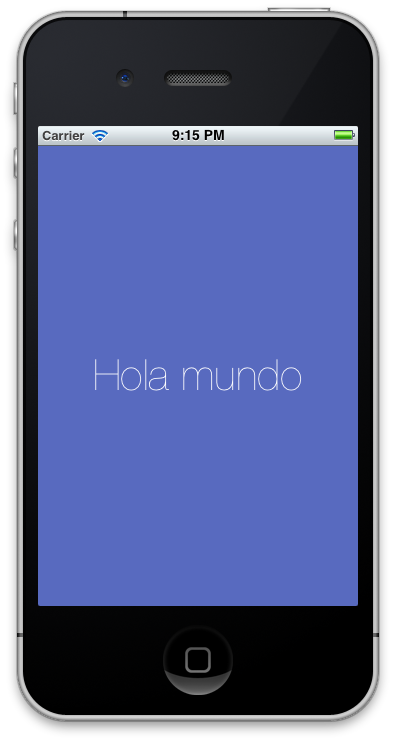

# Hello world (Introducción a Xcode)

Para aprender a utilizar Xcode (el IDE de desarrollo de ObjectiveC) seguiremos los pasos de la creación de un proyecto desde 0 hasta poder ejecutarlo en el simulador. 

## Instalación

Lo primero que debemos hacer es descargar el SDK para iOS. En los ordenadores del curso ya está descargado e instalado para ir adelantando tiempo, pero pongo los enlaces por si quieres instalarlo en tu equipo personal.

Para descargar el SDK tenemos que ir iOS Dev Center (hace falta tener un Apple ID, pero es un registro gratuito).

[https://developer.apple.com/devcenter/ios/index.action]()

En esta página encontrareoms enlaces a la documentación, a ejemplos y a diversos recursos que son muy útiles para el desarrollo de aplicaciones. También encontraremos un enlace a la página de descargar de Xcode 4 que nos redirigirá a la App Store donde nos podremos descargar la última versión de Xcode completamente gratis. El único requesito que tenemos es tener OS X Lion instalado en nuestro equipo.

Para hacer el tutorial se utilizó la versión 4.3, la última versión actualmente.

Este paquete incluye el IDE Xcode, Instruments (herramienta para depurar y perfilar aplicaciones) y el SDK para desarrollar aplicaciones para Mac OS X y para iOS.

La versión gratuita incluye un simulador donde podremos ejecutar nuestras aplicaciones de iPhone o iPad. El simulador no soporta componentes que dependen de hardware como el acelerómetro o la cámara. Con la versión gratuita no podemos probar nuestras aplicaciones en un iPhone real ni distribuir nuestras aplicaciones en la App Store. Para ello debemos registrarnos como desarrolladores y los precios son:

- Standard program $99/año [https://developer.apple.com/programs/ios/](https://developer.apple.com/programs/ios/)
- Enterprise prpogram $299/año [https://developer.apple.com/programs/ios/enterprise/](https://developer.apple.com/programs/ios/enterprise/)

## Creación del proyecto

Abrimos el Xcode y pulsamos en `File/New Project`.

Se mostrará una ventana donde tendremos una serie de plantillas de proyectos. Vamos a seleccionar la plantilla más simple de todas, la `Single View Application` y rellenamos con los datos

- Product Name: HelloWorld
- Company Identifier : com.axelhzf
- Class Prefix : HZF
- Device Family: Iphone
- Marca Automatic Reference Count

Objective C no tiene el conceptos de paquetes, por lo tanto se utilizan prefijos para evitar conflictos en los nombres. Apple se reserva el uso de todos los prefijos de 2 letras, como por ejemplo NSString o NSArray.

## Estructura del proyecto creado

* Hello World : Proyecto
   * `HZFAppDelegate.h` : Interfaz del AppDelegate
   * `HZFAppDelegate.m` : Implementación del AppDelegate
   * `HZFViewController.h` : Interfaz del Controlador
   * `HZFViewController.m` : Implementación del Controlador
   * `HZFViewController.xib` : Vista de interfaz de usuario
   * `Supporting Files` : Código fuente y recursos que no son Objective-C
	   * `HelloWorld-Info.plist` - fichero de properties con información de la aplicación
	   * `InfoPlist.strings` - Properties localizables
	   * `main.m` - método main() . Normalmente no tendrás que cambiar esto
	   * `HelloWorld-Prefix.pch` - lista de .h from external frameworks pch (precompiled header).
* Frameworks : Librerías
* Products : Resultado de las compilación

## Interfaz gráfica de Xcode

Toolbar :

- Run/Stop
- Scheme : Target + Build Settings
- Toggle breakpoints
- Activity View : Muestra la acción que se está procesando
- Editor
  - Standard View : Un único panel
  - Assistant View : Panel dividido en dos
  - Editor de diferencias
- View
- Organizer : Devices/Repositories/Projects/Archives/Documentation

Navigator View:

- Project Navigator
- Symbol Navigator
- Search Navigator
- Issues Navigator
- Debug Navigator
- Breakpoint Navigator
- Log Navigator : Recent  build result and run lugs

JumpBar:

- Related files
- Previous/Next file
- Ruta del fichero con respecto al proyecto. Al final del todo, un ménu con la lista de métodos y otros símbolos definidos en el fichero.

## Atajos de teclado

Para ver los atajos de teclado y para cambiarlos ir a Preferences (Cmd + ,), Key Bindings

- Cmd + B : Compila la aplicación
- Cmd + N : New File
- Cmd + Shift + O : Open quickly
- Cmd + 1, 2, 3, 4, 5, 6, 7 : Cambia entre cada una de las Navigator Views
- Cmd + Alt + 1, 2 , 3, 4, 5, 6 : Cambia entre la parte de arriba
- Cmd + Alt + Ctrl + 3 : Buscar elementos gráficos
- Cmd + R : Compilar y ejecuta la aplicación
- Ctrl + Cmd + Up : Cambiar entre .h y .m

## Interfaces de usuario

Las interfaces se puede codificar a mano, pero es mucho más simple utilizar el editor de interfaces de usuario Interface Builder. Interface Builder a partir de la interfaz gráfica, crea objetos de Objective-C como si escribieras el código a mano y serializa esos objetos en los ficheros xib para que puedan ser cargados directamente en memoria.

Abre el fichero `HZFHelloWorld.xib` que contiene la interfaz de usuario y se abrirá el editor de interfaces. Antes era una aplicación separada que se llamaba Interface Builder, pero a partir de Xcode 4 se integra dentro del propio Xcode.

> Las extensiones de los ficheros son *.xib (moderno) y *.nib (antiguo). Pero se ha quedado como costumbre llamar los ficheros nib files. En muchos sitios de la documentación de la propia apple se nombran nib files.

En este editor, la barra de la izquierda contiene la jerarquia de los elementos que están en la vista.

- File's Owners : Representa el objeto que cargo el fichero nib
- First Responder : Es el elemento con el que el usuario está interactuando. Por ejemplo si el usuario esta introduciendo texto, el first responder será el campo de texto. El first responder va cambiando a medida que el usuario interactura con la aplicación. 
- El terecer icono `View` representa un objeto de la clase `UIView`. Los elementos como botones y campos de texto que añadamos , serán hijos de esta vista.

Para acceder a la Librería de elementos gráficos que podemos utilizar dentro de la interfaz vamos a `View/Utilities/Show Utilities`. Con esto se nos marcará la 3º pestaña del panel derecho inferior.

Busca una label (UILabel) y arrastrala dentro de la view. Es importante que en la vista jerarquica aparezca como hija de la View principal. Doble click y le ponemos el texto 'Hello World'

Luego pulsamos Cmd + R y veremos nuestra aplicación ejecutandose en el simulador.

En el inspector podemos cambiar las propiedades de los elementos. Por ejemplo, vamos a probar a cambiar el color de fondo de la vista y color del texto de la etiqueta.

## Ejercicio completo

Puedes descargarte el código complete desde 

[https://github.com/axelhzf/ios-curso/tree/6652a7aded7ccdd46567cda671e89f6373908faf/HelloWorld2]()

# Conclusiones

Ya tenemos nuestra primera aplicación creada y ya sabemos cómo probarla en simulador. Para poder seguir antes tenemos que saber un poco más de Objective-C, el lenguaje de programación con el que se programa en iOS. Así que ese será nuestro siguiente paso.
