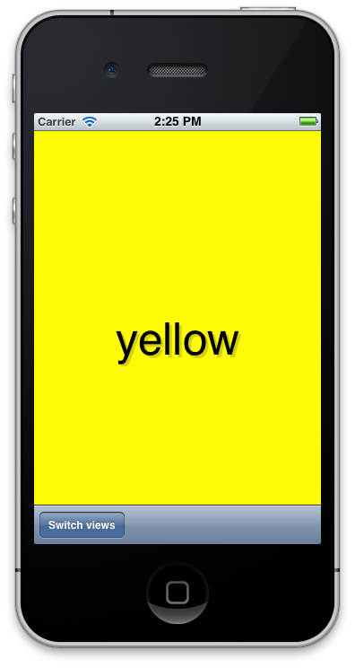

# Varias vistas

Hasta ahora la aplicación de hola mundo con la que hemos estado trabajando tenía una única vista. Lo normal es que las aplicaciones tengan varias vistas conectadas entre sí y que compartan información entre ellas. Por ejemplo, Mail.app, la aplicación para ver el correo que trae por defecto iOS tiene una vista donde se muestra el listado de emails que tienes en la bandeja de entrada y cuando seleccionas uno, puedes ver en otra vista el contenido del email.

El diseño que se suele seguir en estos casos es tener un controlador principal, RootController, que se encargue de mantener las referencias a las diferentes vistas y de mostrar una u otra en el momento adecuado. UIKit trae por defecto algunos RootControllers como pueden ser el `UINavigationController` o el `UITabBarController`. En este ejemplo no utilizaremos ninguno de esas clases, que ya tendremos tiempo de ver cuando empecemos a desarrollar la aplicación del curso.

Vamos a empezar creando un nuevo proyecto, pero esta vez vamos a seleccionar la plantilla `Empty Application`. Esta plantilla lo único que va a hacer es crearnos un `AppDelegate` vacio.

# Application Delegate

Cocoa Touch hace un uso muy intenso del patrón delegates. A grandes rasgos este patrón consiste en que un objeto, en vez de realizar una tarea, delega en otro objeto asociado para que sea el que realice la tarea.

[http://en.wikipedia.org/wiki/Delegation_pattern]()

En nuestro caso, el Application Delegate la clase que se llama cuando la aplicación se inicia.

Para entender el código que se ejecuta cuando se inicia una aplicación, abre el fichero `main.m` que está dentro de la carpeta Supporting Files.

> Para abrir ficheros por el nombre puedes utilizar `Open quickly` con el atajo `Cmd + Shift + O`
    
El main de la aplicación consiste en una llamada a la función UIApplicationMain en la que se le pasa como parámetro nuestra clase AppDelegate. Esta función prepara la aplicación y el ciclo de eventos y llama al delegate.

> Recuerda que haciendo `Alt + click` en un símbolo se mostrará la documentación.

Abre ahora la clase `HZFAppDelegate`. Este delegate implementa el protocolo `UIApplicationDelegate` que contiene métodos que son llamados durante el ciclo de vida de la aplicación. Por ejemplo:

	- (BOOL)application:(UIApplication *)application didFinishLaunchingWithOptions:(NSDictionary *)launchOptions
	- (void)applicationDidEnterBackground:(UIApplication *)application
	- (void)applicationWillTerminate:(UIApplication *)application

# Creando las vistas

Nuestra aplicación va a tener tres controladores distintos:

- HZFSwitchViewController : Controlador principal que se encargará de cambiar de una vista a otra
- HZFBlueViewController  : Controlador de la vista azul
- HZFYellowViewController : Controlador de la vista amarilla

Empezamos creando la primera clase `File/New/File...`, le ponemos de nombre `HZFSwitchViewController` y hacemos que sea subclase de `UIViewController`. Marcamos que la opción de crear fichero xib asociado. Ahora creamos las clases `HZFBlueViewController` y `HZFYellowViewController` de la misma forma.

Abrimos los ficheros `HZFBluewViewController.xib` y `HZFYellowViewController.xib` y le ponemos el color de fondo adecuado a las vistas. En el fichero `HZFSwitchViewController.xib` añadimos una toolbar con un botón que nos va a permitir cambiar de una vista a la otra. Conectamos el evento de ese botón a una IBAction nueva que crearemos en el controlador. La llamaremos `switchViews`.

Como vimos antes, la clase `HZFAppDelegate` es el punto de entrada de nuestra aplicación. Lo que queremos hacer es que la primera vista que aparezca en nuestra aplicación sea la de `HZFSwitchViewController`. 

**HZFAppDelegate.h**

	#import <UIKit/UIKit.h>
	#import "HZFSwitchViewController.h"
	@interface HZFAppDelegate : UIResponder <UIApplicationDelegate>
	@property (strong, nonatomic) UIWindow *window;
	@property (strong, nonatomic) HZFSwitchViewController *viewController;
	@end

**HZFAppDelegate.m**

	@synthesize window = _window, viewController;
    
	- (BOOL)application:(UIApplication *)application didFinishLaunchingWithOptions:(NSDictionary *)launchOptions
	{
	    self.window = [[UIWindow alloc] initWithFrame:[[UIScreen mainScreen] bounds]];
         
	    self.viewController = [[HZFSwitchViewController alloc] initWithNibName:@"HZFSwitchViewController" bundle:nil];
	    self.window.rootViewController = self.viewController;
	    
	    [self.window makeKeyAndVisible];
	    return YES;
	}

Arracando la aplicación en el simulador debería mostrar la vista con la toolbar.

# Conectando las vistas

Paraa intercambiar las vistas, en el SwitchController vamos a tener una referencia a las dos vistas. Cuando se pulse el botón cambiaremos de una a otra vista.

**HZFSwitchViewController.h**

	@interface HZFSwitchViewController : UIViewController
	
	@property (strong, nonatomic) HZFBlueViewController *blueViewController;
	@property (strong, nonatomic) HZFYellowViewController *yellowViewController;
     
	- (IBAction)switchViews:(id)sender;
    
	@end

**HZFSwitchViewController.m**

Sintetizamos las propiedades.

	@synthesize blueViewController, yellowViewController;

Cuando se carga la vista insertamos la vista amarilla. En el método viewDidUnload, como siempre, tenemos que poner a null todas las referencias que tengamos para liberar la memoria.

	- (void)viewDidLoad {
	    [self insertarVistaAmarilla]; 
	    [super viewDidLoad];
	}
    
	- (void)viewDidUnload {    
	    [super viewDidUnload];
	    self.blueViewController = nil;
	    self.yellowViewController = nil;
	}

Para la creación de las vistas utilizamos inicialización lazy. De forma que, en el momento que se vaya a mostrar la vista sea cuando se inicializa a partir del fichero .xib. Una vez creadas mantenemos las referencias para únicamente inicializar una vez.

	-(void)insertarVistaAzul {
	    if (self.blueViewController == nil){
	        self.blueViewController =
	        [[HZFBlueViewController alloc] initWithNibName:@"HZFBlueViewController" bundle:nil];
	    }
	    [self.view insertSubview:self.blueViewController.view atIndex:0];
	}
    
	- (void)insertarVistaAmarilla {
	    if (self.yellowViewController == nil){
	        self.yellowViewController =
	        [[HZFYellowViewController alloc] initWithNibName:@"HZFYellowViewController" bundle:nil];
	    }
	    [self.view insertSubview:self.yellowViewController.view atIndex:0];
	}

La acción de intercambiar las vistas lo único que hace eliminar una vista y mostrar la otra.

	- (IBAction)switchViews:(id)sender {    
	    if ([self isViewVisible:self.blueViewController.view]){
	        [blueViewController.view removeFromSuperview];
	        [self insertarVistaAmarilla];
	    }else{
	        [yellowViewController.view removeFromSuperview];
	        [self insertarVistaAzul];
	    }
	}
	- (BOOL)isViewVisible:(UIView *)view {
	    return view.superview != nil;
	}

# Memory warning

En nuestro caso, la vista que estamos manejando es muy sencilla, pero ¿qué pasaría si las vistas fueran más complejas y consumieran muchos recursos? Estamos consumiendo los recursos de dos vistas, cuando en realidad únicamente estamos mostrando una en pantalla. Lo estamos haciendo para que el cambio entre una vista y la otra sea más rápido, que no se tenga que inicializar la vista en cada cambio.

Cuando el sistema operativo detecta que una aplicación está consumiendo mucha memoria le envia una notificación. Esta notificación lleva a la ejecución de un método que nosotros como programadores debemos implementar para liberar toda la memoria posible. Si el consumo de memoria de nuestra aplicación es crítico, el sistema operativo puede decidir cerrar la apliacción, por lo tanto es importante que seamos cuidadoso con el consumo de memoria, porque puede hacer que nuestra aplicación no funcione correctamente.

Para nuestra aplicación, lo que podemos hacer en cuanto recivamos un aviso de consumo de memoria es liberar la vista que el usuario no está viendo.

    - (void)didReceiveMemoryWarning {
        [super didReceiveMemoryWarning];
        if([self isViewVisible:self.blueViewController.view]){
            self.yellowViewController = nil;
        }else{
            self.blueViewController = nil;
        }
    }

Para probar que este código se ejecuta correctamente, vamos a poner logs en los trozos de código donde se inician las vistas a partir del xib y vamos a simular una aviso de memoria desde el simulador desde `Hardware/Aviso de memoria`.

# Animaciones

[Core Animation](https://developer.apple.com/library/mac/#documentation/cocoa/conceptual/coreanimation_guide/introduction/introduction.html) es la librería que permite hacer animaciones. Con pocas lineas de código se puede conseguir animar la interfaz de nuestra apliación.

	- (IBAction)switchViews:(id)sender {
	    // Inicia el bloque de animación     
	    [UIView beginAnimations:@"View Flip" context:nil];
	    // Duración
	    [UIView setAnimationDuration:1.25];
	    // Tipo de animación: Lento al principio y al final
	    [UIView setAnimationCurve:UIViewAnimationCurveEaseInOut];
         
	    if ([self isViewVisible:self.blueViewController.view]){
	    	// Transición animada
	        [UIView setAnimationTransition: UIViewAnimationTransitionFlipFromRight
	                               forView:self.view cache:YES];
	        
	        [blueViewController.view removeFromSuperview];
	        [self insertarVistaAmarilla];
	    }else{
	    	// Transición animada
	        [UIView setAnimationTransition: UIViewAnimationTransitionFlipFromLeft
	                               forView:self.view cache:YES];
	        
	        [yellowViewController.view removeFromSuperview];
	        [self insertarVistaAzul];
	    }
	    // Termina el bloque de animación
	    [UIView commitAnimations];
	}

Si se pasa el parámetro de cache true, para realiza la animación saca una foto de la vista, y a partir de esa imagen hace la animación. De esta forma se consigue un mejor rendimiento. Debemos pasar este parámetro a true siempre y cuando nuestra vista no vaya a cambiar durante la animación.

# Ejercicios

Si no pudiste seguir las explicaciones anteriores, puedes descargar el código desde [https://github.com/axelhzf/ios-curso/tree/d2c1e1bb258b8d8f3094144993efe031693f846e/MultiViews]() para que tengas una base en la que puedes empezar con los ejercicios.

- Crea una vista nueva `HZFRedViewController` y haz que el botón de cambiar vistas cambie entre todas ellas.
- Prueba otros tipos de animaciones : `UIViewAnimationTransitionFlipFromLeft`, `UIViewAnimationTransitionFlipFromRight`,  `UIViewAnimationTransitionCurlUp`, `UIViewAnimationTransitionCurlDown`
- Prueba a variar otras propiedades, por ejemplo el color de fondo de una vista. Añade un botón a la vista azul, que cuando se pulse cambie el tono de color del azul con una transición.

# Solución

Crear la clase `HZFRedViewController` con fichero xib. Editar el fichero xib para cambiar el color de fondo y ponerle la etiqueta.

En `HZFSwitchViewController` añadir la propiedad que enlaza la nueva vista

	@property (strong, nonatomic) HZFRedViewController *redViewController;

	@synthesize blueViewController, yellowViewController, redViewController;

Libera la memoria

	- (void)viewDidUnload {    
	    [super viewDidUnload];
	    self.blueViewController = nil;
	    self.yellowViewController = nil;
	    self.redViewController = nil;
	}

Método para inicializar e insertar la vista roja en el controlador principal

	- (void)insertarVistaRoja {
	    if (self.redViewController == nil){
	        self.redViewController = [[HZFRedViewController alloc] initWithNibName:@"HZFRedViewController" bundle:nil];
	    }
	    [self.view insertSubview:self.redViewController.view atIndex:0];
	}

Modificación del método switch para tener en cuenta la nueva vista

	- (IBAction)switchViews:(id)sender {     
	    [UIView beginAnimations:@"View Flip" context:nil];
	    [UIView setAnimationDuration:1.25];
	    [UIView setAnimationCurve:UIViewAnimationCurveEaseInOut];
	    if ([self isViewVisible:self.blueViewController.view]){
	        [UIView setAnimationTransition: UIViewAnimationTransitionFlipFromRight
	                               forView:self.view cache:YES];
	        
	        [blueViewController.view removeFromSuperview];
	        [self insertarVistaAmarilla];
	    }else if([self isViewVisible:self.yellowViewController.view]){
	        [UIView setAnimationTransition: UIViewAnimationTransitionCurlDown
	                               forView:self.view cache:YES];
	        
	        [yellowViewController.view removeFromSuperview];
	        [self insertarVistaRoja];
	    }else {
	        [UIView setAnimationTransition: UIViewAnimationTransitionCurlUp
	                               forView:self.view cache:YES];
	        
	        [redViewController.view removeFromSuperview];
	        [self insertarVistaAzul];        
	    }
	    [UIView commitAnimations];
	}

Para la parte de cambiar el color de fondo de forma animada. Añadimos en boton a `HZFBlueViewController.xib`, conectamos la acción del botón con el método:

	- (IBAction)changeColor:(id)sender {
	    [UIView beginAnimations:@"View Flip" context:nil];
	    [UIView setAnimationDuration:1.25];
	    [UIView setAnimationCurve:UIViewAnimationCurveEaseInOut];   
	    self.view.backgroundColor = [UIColor colorWithRed:120/255. green:224/255. blue:1 alpha:1];
	    [UIView commitAnimations];
	}

> Los valores de RGBA van desde 0 hasta el 1. En otras herramientas se suele utilizar valores del 0 al 255. Cuando quieras realizar la conversión lo único que debes hacer es dividir entre 255.

Puedes ver el código completo en:

[https://github.com/axelhzf/ios-curso/tree/93269042b49728c9f09e88c3e478d695ccb362bd/MultiViews]()