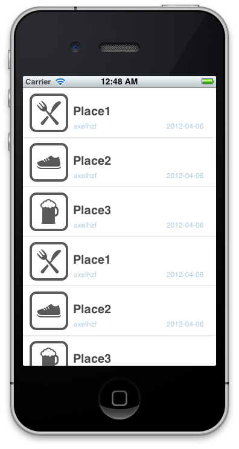

# Tablas

Las tablas son uno de los componentes más ampliamente utilizados en la mayoría de aplicaciones. Es un elemento muy importante en la interfaz de las aplicación. En twosquare la vamos a utilizar para mostrar la lista de checkins.

Las clases que intervienen a la hora de representar una tabla son:

- UITableView : La tabla en si
- UITableViewCell : Cada una de las celdas de una tabla

Para empezar a trabajar con las tablas, vamos a crear un nuevo controlador que llamaremos `HZFCheckinsControllerView` y haremos que sea una subclase de UITableViewController.

Viendo la implementación que nos creó por defecto Xcode, vemos que hay muchos métodos propios de un controlador de tabla. Estos métodos en realidad son de los protocolos `UITableViewDelegate`, `UITableViewDataSource`. El delegate tiene información de cómo se tiene que comportar la tabla, por ejemplo el tamaño de las celdas, el evento de que se seleccionó una celda, etc. Por otro lado el datasource tiene información del contenido que tiene que mostrar la tabla, por ejemplpo el número de celdas, el número de grupos, el contenido de las celdas, etc. Revisa la documentación de las documentación de las dos clases para que veas los métodos que tienen.

Observando la documentación vemos que los únicos métodos que son requeridos son:

* `tableView:cellForRowAtIndexPath` : Devuelve la celda configurada.

* `tableView:numberOfRowsInSection` : Devuelve el número de celdas que hay en cada sección. Por defecto hay una única sección.

Ya que estos métodos son los únicos requeridos, vamos a implementarlos.

**HZFCheckinsViewController.h**

	@property (nonatomic, strong) HZFCheckins *checkins;

**HZFCheckinsViewController.m**

Creamos la instancia de `HZFCheckins` y la cargamos con datos de prueba.

	@synthesize checkins;
    
	- (id)initWithStyle:(UITableViewStyle)style
	{
	    self = [super initWithStyle:style];
	    if (self) {
	        self.checkins = [HZFCheckins checkinsWithFakeData];
	    }
	    return self;
	}

Implementamos los métodos del `UITableViewDataSource`:

	- (NSInteger)tableView:(UITableView *)tableView numberOfRowsInSection:(NSInteger)section {	    
	    return [self.checkins.data count];
	}
  
En este método tenemos que devolver el número de celdas que va a tener nuestra tabla, que vendrá dado por el número de elementos que hay en el array de checkins.  

	- (UITableViewCell *)tableView:(UITableView *)tableView cellForRowAtIndexPath:(NSIndexPath *)indexPath {
	    static NSString *CellIdentifier = @"Cell";
	    UITableViewCell *cell = [tableView dequeueReusableCellWithIdentifier:CellIdentifier];
	    
	    if(cell == nil){
	        cell = [[UITableViewCell alloc] initWithStyle:UITableViewCellStyleDefault reuseIdentifier:CellIdentifier];
	    }
	    
	    HZFCheckin *checkin = [checkins.data objectAtIndex: indexPath.row];    
	    cell.textLabel.text = checkin.nombre;
	    
	    return cell;
	}

En este método se configura el contenido de la celda. Usa un patrón muy interesante, y es el que se implementa el método `dequeueReusableCellWithIdentifier:`. Para hacer más eficiente el scroll, las celdas se reutilizan. Supón que tienes una tabla con 2000 elementos pero en la pantalla del iPhone únicamente se pueden mostrar a la vez unas 10 celdas. No tiene sentido crear una instancia de UITableViewCell que es bastante costosa para cada uno de los elementos. Lo que se hace es tener un pool de celdas y la tabla se encarga de gestionar las que se van a mostrar y las que se van a ocultar. Lo único que nosotros debemos hacer es obtener una celda del pool y configurarla correctamente.

El identificador de la celda permite distinguir el tipo de celda. En nuestro caso tenemos un único tipo de celda.

En el caso de que el método `dequeueReusableCellWithIdentifier:` devuelve nil, tenemos que crear una nueva instancia de celda.

Cuando ya estamos seguros de que tenemos una instancia de `UITableViewCell` lo único que tenemos que hacer es configurarla correctamente. Para ellos buscamos el elemento que tenemos que representar a partir del indexPath (section + row) y configuramos la textLabel.

> Los `\#pragma mark -` sirven para separar secciones del código. Cuando ves la lista de métodos que tiene la clase aparecen por secciones.

Con esto ya tenemos nuestra vista configurada. Ahora lo que nos falta hacer es configurar el App Delegate para que muestre esta vista cuando la aplicación se inicia.

	- (BOOL)application:(UIApplication *)application didFinishLaunchingWithOptions:(NSDictionary *)launchOptions {
	    self.window = [[UIWindow alloc] initWithFrame:[[UIScreen mainScreen] bounds]];
	    self.window.rootViewController = [[HZFCheckinsViewController alloc] initWithStyle:UITableViewStylePlain];
	    self.window.backgroundColor = [UIColor whiteColor];
	    [self.window makeKeyAndVisible];
	    return YES;
	}

Prueba la aplicación en el simulador y comprueba que se muestra correctamente la tabla con los datos de prueba.

# Personalizando las celdas por defecto

En la llamada a a `initWithStyle` le pasamos el estilo `UITableViewStylePlain`. Este es uno de los estilos que tienen las celdas por defecto. Este y el resto de estilos predefinidos están declarados en el enumerado `UITableViewCellStyle`. Prueba los otros estilos:

- UITableViewCellStyleSubtitle
- UITableViewCellStyleValue1
- UITableViewCellStyleValue2

## Ejercicio

Declara una celda de tipo `UITableViewCellStyleSubtitle`, pon un subtitulo en la celda y añade una imagen a las celdas. Si quieres puedes utilizar [http://www.veryicon.com/icon/png/Media/Apple%20TV/Apple%20Logo.png]().

### Pistas:
- Para declarar mostrar una imagen puedes utilizar `[UIImageView imageNamed:@"apple.png"]`
- Busca en la documentación los elementos que tiene una `UITableViewCellStyleSubtitle`

## Solución

Añade la imágen al proyecto y modifica el método `tableView:cellForRowAtIndexPath:`

    if(cell == nil){
        cell = [[UITableViewCell alloc] initWithStyle:UITableViewCellStyleSubtitle reuseIdentifier:CellIdentifier];
    }

    HZFCheckin *checkin = [checkins.data objectAtIndex: indexPath.row];    
    cell.textLabel.text = checkin.nombre;
    cell.detailTextLabel.text = [NSString stringWithFormat:@"Checking from %@", checkin.usuario];
    cell.imageView.image = [UIImage imageNamed:@"apple.png"];

El método `UIImage imageNamed:` cachea las imagenes, por lo tanto es seguro utilizarlo de esta forma, porque no se está leyendo la imagen desde fichero para cada unas de las celdas.

Este caso es un ejemplo simple, en aplicaciones reales deberías utilizar imágenes del tamaño del sitio donde las vas a colocar, para que no seas el dispositivo el que tenga que hacer el escalado. También es conveniente en la medida de lo posible evitar las transparencias porque pueden ralentizar la aplicación.

## Otras personalizaciones de las celdas por defecto

La celdas tienen algunos otras propiedades que puedes modificar para cambiar el comportamiento:

* selectionStyle
* accessoryType y accessoryView
* editingAccessoryType y editingAccessoryView
* showsReorderControl
* backgroundView y selectedBackgroundView
* indentationLevel and indentationWidth

### Ejercicio

Prueba a hacer tabla con estilo cebra, esto quiere decir que las filas pares estén de un color y las impares de otro. Si lo necesitas puedes añadir más datos falsos para comprobar que funciona correctamente.

Pista:
Utiliza el método

	- (void)tableView:(UITableView *)tableView willDisplayCell:(UITableViewCell *)cell forRowAtIndexPath:(NSIndexPath *)indexPath

De UITableViewDelegate que indica cómo se debe pintar una celda. Este método se llama justo antes de pintar una celda. Aquí no se debería tener en cuenta el contenido de la celda.

### Solución

Comprobamos si la celda es par o impar utilizando el módulo. Y si es par le fijamos un color de fondo.

	- (void)tableView:(UITableView *)tableView willDisplayCell:(UITableViewCell *)cell forRowAtIndexPath:(NSIndexPath *)indexPath {
	    if (indexPath.row % 2 == 0) {
	        UIColor *altCellColor = [UIColor colorWithRed:243/255. green:246/255. blue:250/255. alpha:1];
	        cell.backgroundColor = altCellColor;
	    }
	}

**¿Ves algún problema a esta implementación?**

# Personalización de la celda

Si nuestras necesidades no están cubiertas por los estilos por defecto que vienen con la librería siempre podemos crear nuestro propio estilo. Para ello tenemos dos opciones, hacerlo directamente en código o utilizar el editor de interfaces.

En el curso vamos a utilizar la segunda opción, el editor de interfaces gráficas pero dejo un enlace por si alguien está interesado en hacerlo a código. No es complicado.

[https://developer.apple.com/library/ios/#documentation/UserExperience/Conceptual/TableView_iPhone/TableViewCells/TableViewCells.html#//apple_ref/doc/uid/TP40007451-CH7-SW1]()

Para definir una nueva celda con el Interface Builder vamos a aprovecharnos de una característica introducida en las versiones más recientes de Xcode, que son los Storyboards. No vamos a entrar en detalles, ya más adelante tendremos tiempo de hacerlo, pero por ahora lo que debes hacer es crer un nuevo Storyboard: `File/New/File.../User interface/Storyboard` ponle un nombre, por ejemplo el nombre de la aplicación y dale a continuar. Puedes pensar en un Storyboard como en un conjunto de vistas. Además de las vistas, vamos a poder definir las relaciones entre una vista y otra. Vamos a intentar simular el comportamiento que teníamos hasta ahora.

Añadimos un nuevo `Table View Controller` al Storyboard y veremos como automáticamente tendremos una flecha gris apuntando a esa vista. Esto quiere decir que es el punto de entrada del Storyboard. Marcamos el Custom Class con la clase `HZFCheckinsViewController` para asociar el controlador con su vista. Al hacer esto, si miramos en la pestaña de conexiones, automáticamente nos conectará el delegate y el datasource de la tabla al controlador. Ahora lo que debemos decir es que nuestra celda tiene un `content dynamic`. Esto nos va a permitir poder definirnos una serie de plantillas que van a tener cada una de las celdas. La otra opción es definir `content static`. Esto es útil cuando sabemos el número de filas concreto que va a tener nuestra tabla, por ejemplo en un menú. Podemos definir una a una cada una de las celda y personalizarlas como queramos.

Una vez marcado que queremos una tabla de contenido dinámico nos creará una celda de prototipo. A esta celda debemos ponerle un `Identifier` que será el que utilizaremos para poder reutilizar la celda. Marcamos style `basic` que se corresponde UITableViewCellStyleDefault.

Ahora vamos a hacer las modificaciones en el controlador. Cuando una vista es cargada desde un storyboard no se llama al método `initWithStyle:`, sino que se llama al método `initWithCoder:`. Por lo tanto debemos cambiar la inicialización de los datos. Vamos a colocarla en el método `viewDidLoad` que es en realidad el sitio correcto.

	- (void)viewDidLoad {
	    [super viewDidLoad];
	    self.checkins = [HZFCheckins checkinsWithFakeData];  
	}

Ahora el método que reutiliza las celdas, siempre nos devolverá una celda instanciada. Por lo tanto podemos modificar el código:

	- (UITableViewCell *)tableView:(UITableView *)tableView cellForRowAtIndexPath:(NSIndexPath *)indexPath {
	    static NSString *CellIdentifier = @"BasicCell";
	    UITableViewCell *cell = [tableView dequeueReusableCellWithIdentifier:CellIdentifier];
	    HZFCheckin *checkin = [checkins.data objectAtIndex: indexPath.row];    
	    cell.textLabel.text = checkin.nombre;
	    return cell;
	}

Ahora lo que tenemos que configurar en el AppDelegate es que cuando se inicie la aplicación se cargue nuestro StoryBoard. Es muy sencillo, lo único que tenemos que hacer es vaciar el método:

	- (BOOL)application:(UIApplication *)application didFinishLaunchingWithOptions:(NSDictionary *)launchOptions {
	    return YES;
	}

Y configurar en la configuración del proyecto el `Main Storyboard`.

Ahora al ejecutar el proyecto, deberías ver la misma tabla que teníamos al principio.

### Ejercicio

* Crea dos celdas prototipo distintas, cambiando por ejemplo el color de fondo y pon las celdas pares de un tipo y las impares de otro.

## Tags o Subclase de UITableViewCell

Cuando queremos añadir subvistas a la celda tenemos dos opciones, utilizar los tags que podemos asociar a cada uno de las vista o crear una subclase de UITableViewCell.

Modificamos nuestro código para deshacer el ejercicio anterior, dejando un único prototipo de celda. Ahora añadimos otra etiqueta a la vista. Configuramos un valor de tag distinto para cada uno de las celdas. El tag nos va a permitir diferenciar entre una etiqueta y la otra. 

	- (UITableViewCell *)tableView:(UITableView *)tableView cellForRowAtIndexPath:(NSIndexPath *)indexPath {
	    static NSString *CellIdentifier = @"BasicCell";
	    UITableViewCell *cell = [tableView dequeueReusableCellWithIdentifier:CellIdentifier];
	    
	    UILabel *label1 = (UILabel *)[cell viewWithTag:1];
	    UILabel *label2 = (UILabel *)[cell viewWithTag:2];    
	    
	    HZFCheckin *checkin = [checkins.data objectAtIndex: indexPath.row];    
	    label1.text = checkin.nombre;
	    label2.text = checkin.usuario;
	    return cell;
	}

Esta es una forma rápida de trabajar con las subvistas. Si la celda es más complicada, deberíamos optar por crear una subclase de UITableViewCell.

Para ello lo único que tenemos que hacer es crear una nueva clase que extienda de UITableViewCell. En el Interface Builder indicamos que el custom class de nuestro prototipo es el que acabos de crear y creamos IBOutlets para cada uno de los elementos que pongamos en nuestra celda. A la de configurar la celda, trabajaríamos directamente con las propiedades y no buscando vistas a partir de los tags.

	- (UITableViewCell *)tableView:(UITableView *)tableView cellForRowAtIndexPath:(NSIndexPath *)indexPath {
	    static NSString *CellIdentifier = @"BasicCell";
	    HZFCheckinTableViewCell *cell = [tableView dequeueReusableCellWithIdentifier:CellIdentifier];
	    
	    HZFCheckin *checkin = [checkins.data objectAtIndex: indexPath.row];    
	    cell.labelName.text = checkin.nombre;
	    cell.labelUser.text = checkin.usuario;
	    
	    return cell;
	}

# Ejercicio

Prepara la celda para mostrar los checkins:
* Muestra el nombre, la fecha y el usuario
* Muestra una imágen según la categoría. Puedes utilizar estos iconos

Pistas:
* Para formatear las fechas utiliza la clase `NSDateFormatter`.

# Solución

[https://github.com/axelhzf/ios-curso/tree/ceb8a958c309deb144758b73a3cead1af9393f40]()

